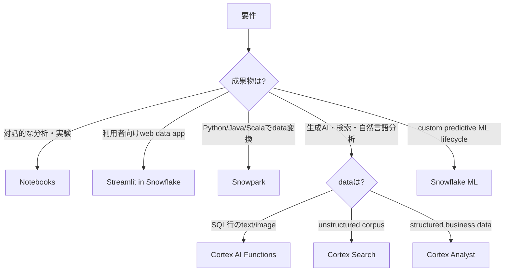

# AI/ML・application開発機能の選定

```mermaid
flowchart TD
  R[要件] --> E{成果物は?}
  E -->|対話的な分析・実験| N[Notebooks]
  E -->|利用者向けweb data app| S[Streamlit in Snowflake]
  E -->|Python/Java/Scalaでdata変換| P[Snowpark]
  E -->|生成AI・検索・自然言語分析| C{dataは?}
  C -->|SQL行のtext/image| F[Cortex AI Functions]
  C -->|unstructured corpus| CS[Cortex Search]
  C -->|structured business data| CA[Cortex Analyst]
  E -->|custom predictive ML lifecycle| M[Snowflake ML]
```

これらは組み合わせられます。NotebookでSnowpark MLを試し、Model Registryへ登録し、Streamlitからinferenceを呼ぶ構成も可能です。
