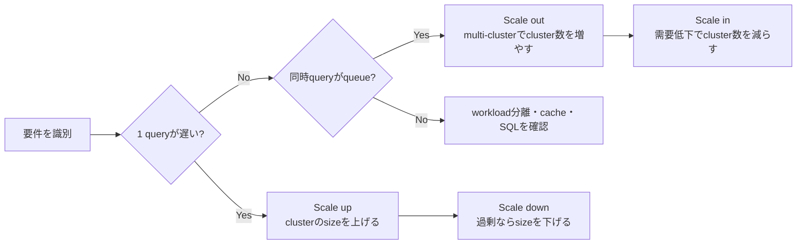

# Virtual Warehouse の2つの拡張軸

```mermaid
flowchart LR
  Q[要件を識別] --> P{1 queryが遅い?}
  P -->|Yes| U[Scale up\nclusterのsizeを上げる]
  P -->|No| C{同時queryがqueue?}
  C -->|Yes| O[Scale out\nmulti-clusterでcluster数を増やす]
  C -->|No| I[workload分離・cache・SQLを確認]
  U --> D[Scale down\n過剰ならsizeを下げる]
  O --> N[Scale in\n需要低下でcluster数を減らす]
```

Sizeは各clusterのcompute量、cluster数は同時workloadの受け皿です。大きいwarehouseが常に高concurrencyの最適解ではありません。
