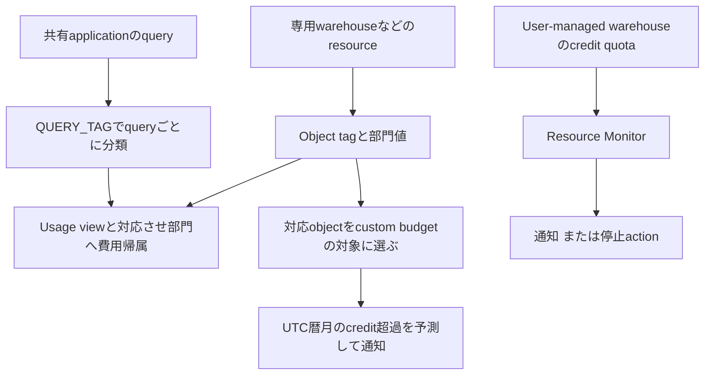

# 費用の分類・予測・停止

> Status: complete
> Last verified: 2026-10-03

Tagは分類metadataです。費用の測定はusage view、超過予測はBudget、warehouseの組み込み停止actionはResource Monitorが担当します。Budgetのlimit設定だけでは停止しません。別途custom actionとprocedureを設定すれば処理を追加できます。

## 根拠

- `docs-cost-attributing` — https://docs.snowflake.com/en/user-guide/cost-attributing
- `docs-budgets` — https://docs.snowflake.com/en/user-guide/budgets
- `docs-resource-monitors` — https://docs.snowflake.com/en/user-guide/resource-monitors
- `docs-budget-custom-actions` — https://docs.snowflake.com/en/user-guide/budgets/custom-actions
