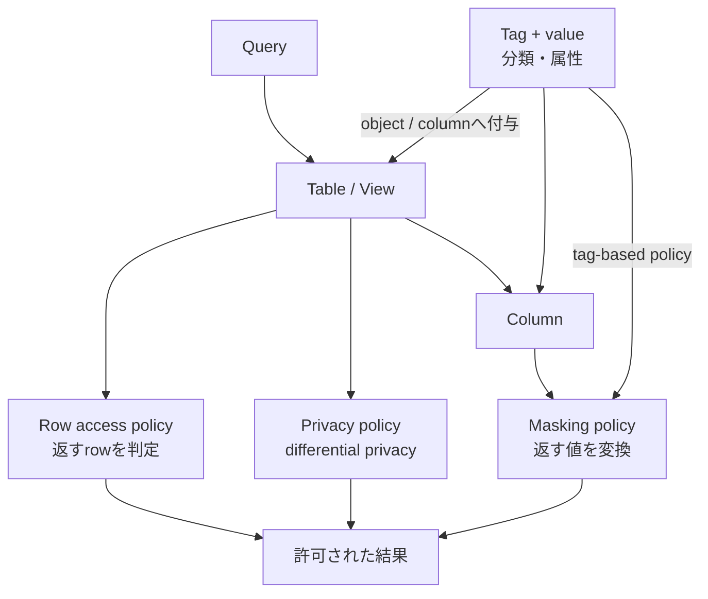

# Governance policyの適用単位

- Row access policyは行、masking policyは列値、privacy policyは個人の情報推測リスクを制御します。
- Tagは分類用metadataであり、単独ではrowをfilterしたり値をmaskしたりしません。

根拠: `docs-column-security`, `docs-row-access-policies`, `docs-object-tagging`, `docs-differential-privacy`
