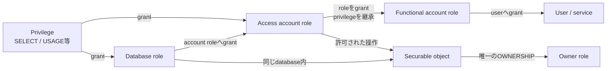

# Role・privilege・objectの関係

- Roleはprivilegeをまとめ、userへ直接objectを大量grantする代わりに使います。
- Database roleはsessionで直接activateせず、account roleへgrantして利用します。
- Object ownerがaccessを委任できる点がDAC、role経由で利用者へ届ける点がRBACです。

根拠: `docs-access-control-overview`, `docs-access-control-best-practices`
