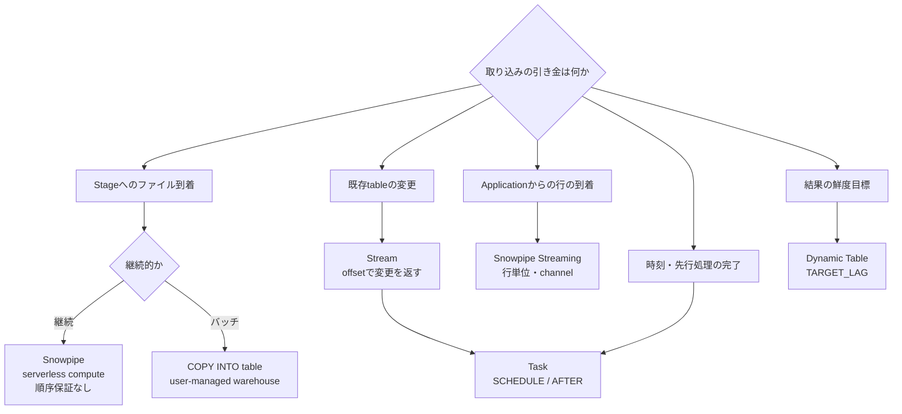

# 取り込み方式の選定

- Snowpipeとbulk `COPY INTO`の差はcomputeの担い手と課金であり、どちらもファイル単位で取り込みます。
- Streamは変更を返すだけで実行しません。実行はTaskが担うため、この2つは組で使います。
- Dynamic Tableは引き金を鮮度目標として宣言し、refreshの順序と実行をSnowflakeへ委ねます。

根拠: `docs-data-load-overview`, `docs-snowpipe-intro`, `docs-snowpipe-streaming-overview`, `docs-streams-intro`, `docs-tasks-intro`, `docs-dynamic-tables`
