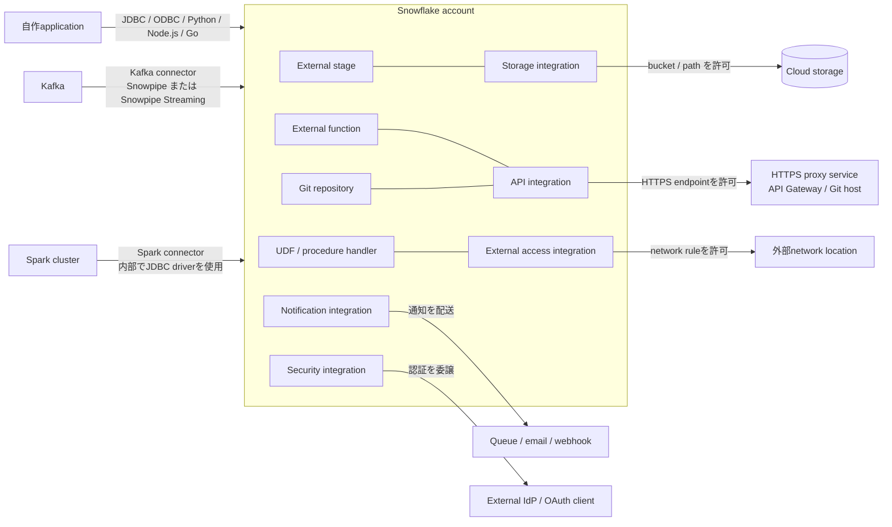

# Driver・connector・integrationの担当範囲

- 左からSnowflakeへ入る矢印がdriverとconnector、Snowflakeから外へ出る矢印がintegrationです。
- Storage integrationは`STORAGE_ALLOWED_LOCATIONS`でbucketとpathを、API integrationは`API_ALLOWED_PREFIXES`でHTTPS endpointを許可します。
- Git repositoryはAPI integration（`API_PROVIDER = git_https_api`）とsecretを前提に構成します。

根拠: `docs-drivers-overview`, `docs-kafka-connector-overview`, `docs-spark-connector-overview`, `docs-storage-integration-ddl`, `docs-api-integration-ddl`, `docs-git-repository-ddl`, `docs-external-access-integration-ddl`, `docs-notification-integration-ddl`, `docs-security-integration-ddl`
