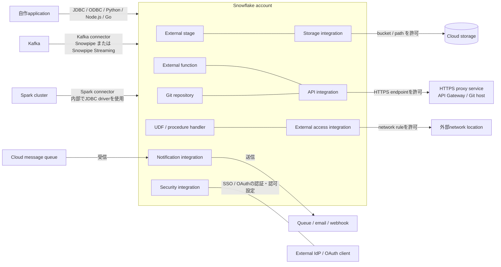

# Driver・connector・integrationの担当範囲

```mermaid
flowchart LR
  APP[自作application] -->|JDBC / ODBC / Python / Node.js / Go| SF
  KAFKA[Kafka] -->|Kafka connector<br/>Snowpipe または Snowpipe Streaming| SF
  SPARK[Spark cluster] -->|Spark connector<br/>内部でJDBC driverを使用| SF

  subgraph SF[Snowflake account]
    STG[External stage] --- SI
    EF[External function] --- AI
    GR[Git repository] --- AI
    UDF[UDF / procedure handler] --- EAI
    SI[Storage integration]
    AI[API integration]
    EAI[External access integration]
    NI[Notification integration]
    SEC[Security integration]
  end

  SI -->|bucket / path を許可| CS[(Cloud storage)]
  AI -->|HTTPS endpointを許可| HS[HTTPS proxy service<br/>API Gateway / Git host]
  EAI -->|network ruleを許可| NET[外部network location]
  NI -->|送信| MSG[Queue / email / webhook]
  INQ[Cloud message queue] -->|受信| NI
  SEC ---|SSO / OAuthの認証・認可設定| IDP[External IdP / OAuth client]
```

- Driverとconnectorは外部application／productの接続部品、integrationはSnowflake account内の連携設定objectです。矢印は主なアクセスや通知の向き、線は設定の対応関係を表します。
- Security integrationはSSOやOAuthの認証・認可、notification integrationは通知の送信または受信に使います。Integrationを外向き通信だけに限定しません。
- Storage integrationは`STORAGE_ALLOWED_LOCATIONS`でbucketとpathを、API integrationは`API_ALLOWED_PREFIXES`でHTTPS endpointを許可します。
- Git repositoryはAPI integration（`API_PROVIDER = git_https_api`）を参照します。token認証ではsecretも使い、認証なしではsecretを省略します。

根拠: `docs-drivers-overview`, `docs-kafka-connector-overview`, `docs-spark-connector-overview`, `docs-storage-integration-ddl`, `docs-api-integration-ddl`, `docs-git-repository-ddl`, `docs-external-access-integration-ddl`, `docs-notification-integration-ddl`, `docs-security-integration-ddl`, `docs-security-integration-saml2`
