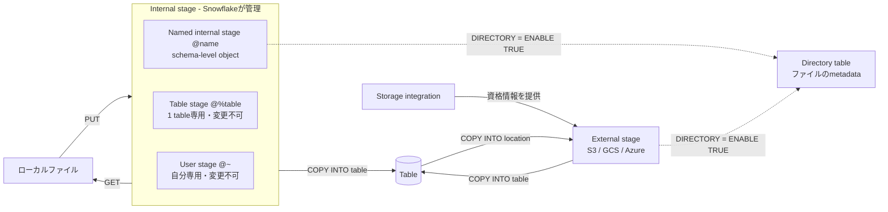

# Stageの種類と権限の対応

- Privilegeは種類で異なります。External stageは`USAGE`（`READ`と`WRITE`を含む）、internal stageは`READ`と`WRITE`を個別にgrantします。
- `PUT`と`GET`はローカルとinternal stageの間だけで使い、`GET`はexternal stageに使えません。どちらもSnowsightのworksheetからは実行できません。
- Directory tableはinternal／externalの両方のstageに付けられ、ファイル本体ではなくmetadataを保持します。

根拠: `docs-create-stage`, `docs-data-load-local-create-stage`, `docs-access-control-privileges`, `docs-put`, `docs-get`, `docs-data-load-dirtables`
