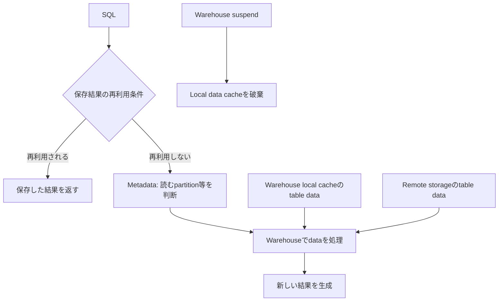

# 保存結果・metadata・local dataの違い

理解のために処理を簡略化しています。metadataだけで答えられる処理もあります。suspendは保存結果やmetadataを同時に削除する命令ではありません。USE_CACHED_RESULTは保存結果の再利用を制御します。

根拠: `docs-persisted-results`, `docs-warehouse-cache`, `docs-micro-partitions`, `docs-count`。
