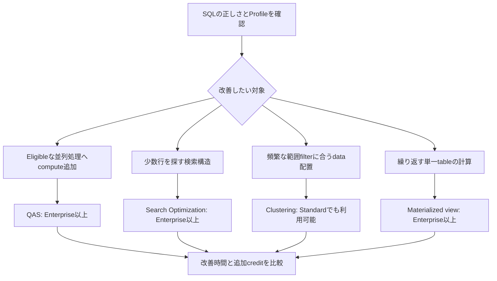

# 何を変えて性能を改善するか

候補を選ぶ図で、どれか1つだけを使う制約ではありません。検索構造でscan対象を減らし、残るeligibleな処理をQASへ渡す併用も可能です。JOINやwindowを含む任意のSQLをmaterialized viewとして保存できるわけではありません。

根拠: `docs-performance-options`, `docs-performance-storage`, `docs-query-acceleration`, `docs-materialized-views`。
