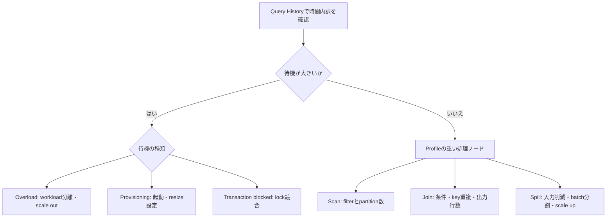

# 遅さの症状から調査先を選ぶ

待機と処理の問題を先に分けます。scan量や行数は要件と比較し、全件scanや正しいone-to-many JOINを異常と決めつけません。QAS有効時の少量remote書き込みも、重大なspillとは限りません。

根拠: `docs-query-profile`, `docs-query-history`, `docs-memory-spillage`, `docs-query-insights`, `docs-reducing-queues`。
