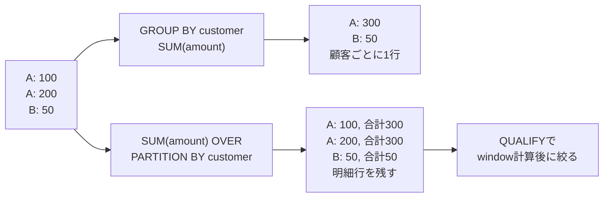

# GROUP BYとwindow計算の出力粒度

PARTITION BYはwindow計算のgroupを作る指定で、table storageのmicro-partitionを操作する指定ではありません。window内のORDER BYも最終結果の返却順とは別です。

根拠: `docs-aggregate-functions`, `docs-window-functions`, `docs-qualify`。
