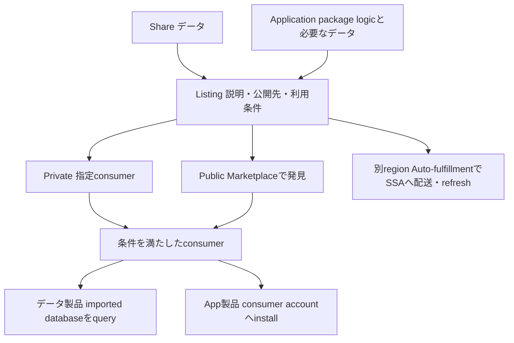

# Listingの製品と利用経路

> Status: complete
> Last verified: 2026-10-03

Private／publicは公開先、free／trial／paidはアクセス条件です。別region配送には時間と費用が必要です。Appのinstallとconsumerデータへの許可は別です。

## 根拠

- `docs-listings` — https://docs.snowflake.com/en/collaboration/collaboration-listings-about
- `docs-auto-fulfillment` — https://docs.snowflake.com/en/collaboration/provider-listings-auto-fulfillment
- `docs-native-app-framework` — https://docs.snowflake.com/en/developer-guide/native-apps/native-apps-about
