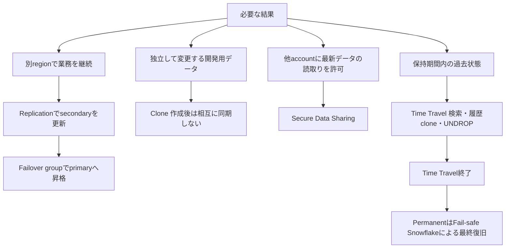

# データ保護手段の選定

> Status: complete
> Last verified: 2026-10-03

Time TravelからFail-safeへの矢印は標準permanent tableの履歴ライフサイクルです。Transient／temporaryはFail-safeを持ちません。Failoverと他のaccount objectの複製はBusiness Critical以上です。

## 根拠

- `docs-time-travel` — https://docs.snowflake.com/en/user-guide/data-time-travel
- `docs-fail-safe` — https://docs.snowflake.com/en/user-guide/data-failsafe
- `docs-clone-storage` — https://docs.snowflake.com/en/user-guide/tables-storage-considerations
- `docs-replication-bcdr` — https://docs.snowflake.com/en/user-guide/replication-intro
- `docs-secure-sharing` — https://docs.snowflake.com/en/user-guide/data-sharing-intro
