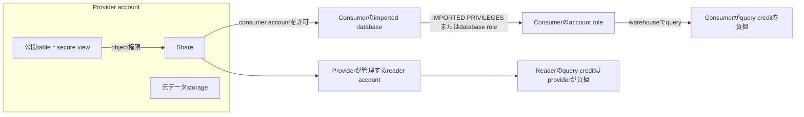

# Providerとconsumerの許可境界

> Status: complete
> Last verified: 2026-10-03

同一regionの通常共有ではconsumerに共有データの物理コピーを保存しません。Imported objectは読取り専用です。Readerは作成providerのデータだけを利用します。

## 根拠

- `docs-secure-sharing` — https://docs.snowflake.com/en/user-guide/data-sharing-intro
- `docs-sharing-provider` — https://docs.snowflake.com/en/user-guide/data-sharing-provider
- `docs-sharing-consumer` — https://docs.snowflake.com/en/user-guide/data-share-consumers
- `docs-reader-accounts` — https://docs.snowflake.com/en/user-guide/data-sharing-reader-create
