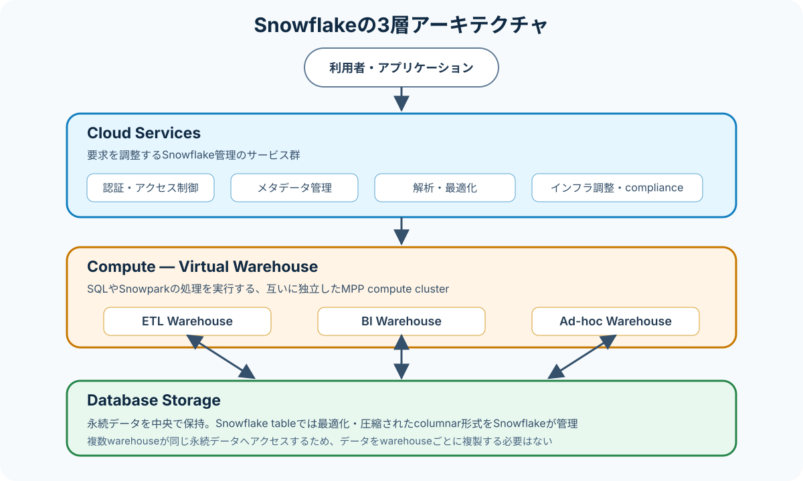

# 1.1 アーキテクチャを説明し、利用する

> Status: complete
> Last verified: 2026-08-13

## この章で学ぶこと

この章を終えると、次を説明できるようになります。

- Snowflakeの3層と、それぞれの責務
- 中央のstorageと独立したcomputeを組み合わせる利点
- queryを実行したとき、要求が3層をどう通るか
- Standard、Enterprise、Business Critical、Virtual Private Snowflake（VPS）の選定軸
- Edition、warehouse size、cloud platform／regionの違い

## 前提知識

- storageはデータを永続的に保持し、computeは計算を実行するという違い
- SQL queryが「要求を解析する処理」と「実際にデータを読む処理」に分けられること
- authentication（本人確認）とauthorization（許可された操作の判定）の違い

## この章の用語

| 用語 | この章での意味 |
|---|---|
| Database Storage | 永続データを保持する層 |
| Compute | SQLやSnowparkの処理を実行する層。中心となる資源はVirtual Warehouse |
| Cloud Services | 認証、メタデータ、query解析・最適化など、Snowflake全体を調整する層 |
| Virtual Warehouse | 1つ以上のcompute clusterから成る、ユーザーが管理する計算資源 |
| MPP | Massively Parallel Processing。複数nodeで処理を並列実行する方式 |
| Edition | 利用可能な機能やサービス水準を定める契約上の区分 |
| metadata | dataの名前、構造、配置、統計など、dataを管理・処理するための情報 |
| role | 利用者や処理へ権限をまとめて与える単位 |
| DML | tableのdataを読み書きするSQL操作。Data Manipulation Language |
| Snowpark | Java、Python、ScalaなどのcodeをSnowflakeで実行するための機能群 |
| credit | Snowflakeのcomputeなどの利用量を表す課金単位 |
| micro-partition | Snowflake tableのdataを自動分割して保存する連続したstorage単位 |
| PHI | Protected Health Information。個人を識別できる保護対象の医療情報 |
| BAA | Business Associate Agreement。PHIを扱う際に必要となる事業提携者契約 |

## 試験範囲との対応

| Topic | 本文 | 主な公式根拠 |
|---|---|---|
| Cloud Services layer | [Cloud Services](#cloud-services-layer) | `docs-key-concepts-architecture` |
| Compute layer | [Compute](#compute-layer) | `docs-key-concepts-architecture`, `docs-compute-cost` |
| Database Storage layer | [Database Storage](#database-storage-layer) | `docs-key-concepts-architecture` |
| Snowflake Editionの比較 | [Edition](#snowflake-editions) | `docs-snowflake-editions` |

公式のObjectiveとTopicは、[COF-C03 Syllabus](../../docs/syllabus.md#11-アーキテクチャを説明し利用する)から[公式Study Guide](https://publish-p93462-e887935.adobeaemcloud.com/content/dam/snowpro-sg/SnowProCoreStudyGuideC03.pdf)へ辿って確認できます。

## 3層に分ける理由



Snowflakeでは、複数のcomputeが中央の永続データを共有します。
一方、queryを実行するcompute resourceはVirtual Warehouseごとに独立しています。
この組み合わせにより、同じdataを使うETLとdashboardを、dataのcopyを作らず別々のcomputeで処理できます。

公式ドキュメントでは、中央のstorageを共有する特徴をshared-disk型、compute clusterが資源を共有しない特徴をshared-nothing型になぞらえています。
Snowflakeは両方の特徴を組み合わせています。

3層が完全に無関係というわけではありません。
分離されているのは、**storage、queryを実行するcompute、全体を調整するservicesの責務**です。
Snowflake accountの3層は、選択したAWS、Microsoft Azure、Google Cloudのいずれかのcloud platform上にSnowflakeによって配置・管理されます。

## 3層の責務

<a id="cloud-services-layer"></a>
### Cloud Services layer

Cloud Servicesは、利用者の要求を受け付けてSnowflake全体を調整します。
試験で層を判別する手掛かりになる責務は次のとおりです。

- security、authentication、access control
- metadata管理
- queryのparseとoptimization

このほか、次の処理も担います。

- cloud infrastructureの管理
- Snowflake Horizon Catalog
- regulatory complianceに関わる処理

たとえば`SELECT`を送信すると、Cloud Servicesは利用者とroleを確認し、objectのmetadataを参照して、queryを解析・最適化します。
その後、必要な実行処理をcomputeへ渡します。

Cloud Servicesもcloud providerから確保されたcompute instance上で動きます。
ただし、通常のquery実行に使うユーザー管理のVirtual Warehouseと同じものではありません。
Cloud Servicesの資源はSnowflakeが管理します。

<a id="compute-layer"></a>
### Compute layer

Compute layerの中心はVirtual Warehouseです。
Virtual WarehouseはSQL statement、data loadingなどのDML、Snowparkのcodeを実行するcompute clusterです。

Virtual Warehouse同士はcompute resourceを共有しません。
たとえばETL用warehouseで重い処理を実行しても、別のBI用warehouseのcomputeを直接奪いません。
この独立性により、workloadごとに性能とコストを調整できます。

一方、warehouseが独立しているのは**compute**です。永続データをwarehouseごとに複製する必要はなく、複数warehouseが中央のstorageへアクセスします。

Virtual Warehouseはユーザーがsize、起動、停止などを管理し、running中の処理時間に応じてcreditを消費します。Snowflake管理のserverless computeやCloud Services computeとは管理方式が異なります。

<a id="database-storage-layer"></a>
### Database Storage layer

Database Storageは永続データを保持します。
Snowflake tableへloadしたデータについて、Snowflakeは次を自動管理します。

- cloud storageへの配置
- 最適化・圧縮されたcolumnar形式
- file sizeと構造
- metadataと統計情報
- micro-partitionへの分割

利用者が物理fileの配置を直接管理するのではありません。
このstorageを複数のVirtual Warehouseが利用できるため、同じデータに対してETL、BI、ad-hoc analysisを別warehouseで同時に実行できます。

なお、すべてのtableがSnowflake管理storageだけを使うわけではありません。
Apache Iceberg tableなど外部cloud storageを利用するtableもあります。
Objective 1.1で覚える中心は、3層の責務と分離です。
table typeの詳細は[1.5 ストレージ概念](05-storage-concepts.md)で扱います。

## queryが3層を通る流れ

次の流れを軸に考えると、設問で層を判別しやすくなります。

1. clientがSQL queryをSnowflakeへ送る。
2. Cloud Servicesがauthentication／authorizationを確認する。
3. Cloud Servicesがmetadataを参照し、queryをparse・optimizeする。
4. Virtual Warehouseが実行計画に従って処理する。
5. WarehouseがDatabase Storageから必要なdataを読み、必要に応じて結果を書き込む。
6. 結果がclientへ返る。

この流れは役割を理解するための概念モデルです。すべてのqueryが必ずstorageをscanするとは限りません。cacheなどにより処理が省略される場合があり、その詳細は[4.3 キャッシュ](../domain-4/03-caching.md)で扱います。

## 利用者が選ぶ3つの軸

3層そのものを利用者がinstallしたり構築したりする必要はありません。Snowflakeはcloud infrastructure上で提供され、software updateや基盤管理もSnowflakeが行います。

利用者が選択・管理する代表例は次のとおりです。

- accountを配置するcloud platformとregion
- accountのEdition
- workloadに使うVirtual Warehouseのsizeや稼働設定

これらは別々の軸です。Editionを上げてもwarehouseが自動的に大きくなるわけではなく、warehouseを大きくしてもEdition限定機能が有効になるわけではありません。

## 公式ドキュメントで根拠を確認する

公式ドキュメントは最初から最後まで暗記するのではなく、Study GuideのTopicに対応する記述を探します。Objective 1.1では、次の順に確認すると本文と公式情報を対応付けられます。

1. [Snowflake key concepts and architecture](https://docs.snowflake.com/en/user-guide/intro-key-concepts)の「Snowflake architecture」で、3層の図と各layerの説明を確認する。
2. 同じページのComputeで、Virtual Warehouseが他のwarehouseとcompute resourceを共有しない記述を確認する。
3. Database Storageで、Snowflake tableのdataが最適化・圧縮されたcolumnar形式でcloud storageへ保存される記述を確認する。
4. Cloud Servicesで、authentication、metadata管理、queryのparse／optimizationを確認する。
5. [Snowflake editions](https://docs.snowflake.com/en/user-guide/intro-editions)の概要で、上位Editionが下位Editionへ機能を追加する関係を確認する。
6. 同ページのEdition matrixで、本文にある代表例が現在も対象Editionに含まれるか確認する。

読み終えたら、次の問いへ本文を見ずに答えます。

- 中央で共有されるものと、warehouseごとに独立するものは何か。
- queryの解析と実行は、それぞれどのlayerが主に担うか。
- security機能が必要な場合、Editionとwarehouse sizeのどちらを確認するか。

公式ページにはObjective 1.1より広い機能も掲載されています。Iceberg table、Hybrid table、warehouse scalingなどの詳細へ進みすぎず、この3問の根拠を特定できたところで次へ進みます。

## 現在のEditionを確認する

現在のEditionは、権限があれば`SNOWFLAKE.ORGANIZATION_USAGE.ACCOUNTS`で確認できます。

```sql
SELECT edition
FROM SNOWFLAKE.ORGANIZATION_USAGE.ACCOUNTS
WHERE account_name = CURRENT_ACCOUNT();
```

このviewをqueryするには`ORGANIZATION_USAGE`への適切なaccessが必要です。結果はaccountのEditionを示し、使用中のwarehouse sizeを示すものではありません。

## ミニハンズオン：同じdataを2つのwarehouseから利用する

この演習では、ETL用とBI用の2つのVirtual Warehouseを作り、同じtableを利用します。2つのwarehouseが共有するものと、共有しないものを実際に確認します。

### 実行前の条件

- Snowflakeのtrial accountなど、演習用accountを使用する。
- `SYSADMIN`、またはwarehouse、database、tableを作成できるroleを使用する。
- Warehouseが動作するとcreditを消費する。演習では`XSMALL`、`AUTO_SUSPEND = 60`、`INITIALLY_SUSPENDED = TRUE`を指定し、終了後に削除する。
- 同名のobjectが存在する場合は実行せず、演習専用の名前へ変更する。
- 組織の共有accountでは、管理者が定めた命名規則とcost管理ルールを優先する。

### 1. 2つのwarehouseを作成する

```sql
USE ROLE SYSADMIN;

CREATE WAREHOUSE OBJ11_ETL_WH
  WAREHOUSE_SIZE = 'XSMALL'
  AUTO_SUSPEND = 60
  AUTO_RESUME = TRUE
  INITIALLY_SUSPENDED = TRUE;

CREATE WAREHOUSE OBJ11_BI_WH
  WAREHOUSE_SIZE = 'XSMALL'
  AUTO_SUSPEND = 60
  AUTO_RESUME = TRUE
  INITIALLY_SUSPENDED = TRUE;
```

作成した2つのwarehouseは、どちらもCompute layerの独立したcompute resourceです。この時点では、dataをwarehouseごとに作成していません。

### 2. ETL用warehouseでtableを作成する

```sql
CREATE DATABASE OBJ11_LAB;

USE WAREHOUSE OBJ11_ETL_WH;

CREATE TABLE OBJ11_LAB.PUBLIC.EVENTS AS
SELECT * FROM VALUES
  (1, 'loaded by ETL'),
  (2, 'shared persistent data')
  AS events(event_id, description);
```

`CREATE TABLE ... AS SELECT`の処理には`OBJ11_ETL_WH`を使います。作成されたtableの永続dataは`OBJ11_ETL_WH`の内部だけに保存されるのではなく、Database Storage layerで管理されます。

### 3. BI用warehouseから同じtableをqueryする

```sql
USE WAREHOUSE OBJ11_BI_WH;

SELECT CURRENT_WAREHOUSE(), event_id, description
FROM OBJ11_LAB.PUBLIC.EVENTS
ORDER BY event_id;
```

`CURRENT_WAREHOUSE()`は`OBJ11_BI_WH`を示しますが、ETL用warehouseで作成した2行を取得できます。永続dataを共有しながら、queryを実行するcomputeは切り替わっています。

### 4. 3層へ分類する

実行した操作を次のように分類します。

| 観察したこと | 対応するlayer |
|---|---|
| roleとobjectへのaccessを確認し、SQLをparse／optimizeする | Cloud Services |
| `CREATE TABLE ... AS SELECT`と`SELECT`を実行する | 選択中のVirtual Warehouse |
| `EVENTS`の永続dataを保持する | Database Storage |

### 5. 演習用objectを削除する

```sql
DROP DATABASE IF EXISTS OBJ11_LAB;
DROP WAREHOUSE IF EXISTS OBJ11_ETL_WH;
DROP WAREHOUSE IF EXISTS OBJ11_BI_WH;
```

この演習では独立性の確認だけを扱います。warehouse size、auto-suspend、scalingの選定は[1.4 Virtual Warehouse](04-virtual-warehouses.md)で詳しく扱います。

<a id="snowflake-editions"></a>
## Snowflake Edition

Editionは下位Editionを土台に、上位になるほど追加機能やより高いservice levelを提供する関係です。機能の完全な一覧は変更されうるため、利用判断時には公式のEdition matrixを確認します。

| Edition | 位置付け | 代表的な選定理由 |
|---|---|---|
| Standard | 基本Edition | Snowflakeのstandard featureを使う一般的なworkload |
| Enterprise | Standardにenterprise向け機能を追加 | extended Time Travel、column／row level securityなどが必要 |
| Business Critical | Enterpriseに強化されたsecurity／data protectionを追加 | PHIなどの高機密data、private connectivity、Tri-Secret Secure、account failover／failbackなどが必要 |
| Virtual Private Snowflake（VPS） | Business Criticalを基に、他accountから隔離された専用Snowflake環境 | 最も厳しいisolation要件がある |

### Edition選定で注意すること

- 上位Editionは下位Editionの単なる「高速版」ではない。
- warehouse sizeはcompute能力、Editionは利用可能な機能・service levelの軸である。
- Business CriticalでPHIを扱う場合、Editionだけで条件が完了するわけではなく、SnowflakeとのBAAなど必要条件がある。
- VPSは単にprivate network接続を有効にする機能名ではなく、他のSnowflake accountとhardware resourceを共有しない隔離環境である。
- cloud platform、region、契約方式も単価や利用可否へ影響し、Editionだけで全条件は決まらない。

## 分離とEditionを使い分ける場面

### workloadを分離したい

同じdataを使うETLとdashboardが互いのcompute性能へ直接影響しないようにしたい場合、別々のVirtual Warehouseを利用します。dataのcopyを用途ごとに作ることが第一選択ではありません。

### data量とquery負荷を別々に拡張したい

storageとcomputeが分離されているため、保存dataが増えたことと、query computeを増強することを別々に考えられます。computeの具体的なsizing／scalingはObjective 1.4で扱います。

### governance機能が必要

row access policyなどEnterprise以上の機能が必要なら、warehouseを大きくするのではなくEdition要件を確認します。

### 厳格なdata protectionやisolationが必要

規制、private connectivity、customer-managed keyなどの要件ではBusiness Critical以上を検討します。他accountとhardware resourceを共有しない環境が必要ならVPSを検討します。

## 3層と選定軸の比較

| 比較軸 | Database Storage | Virtual Warehouse | Cloud Services |
|---|---|---|---|
| 主目的 | 永続dataの保持 | query／DML／codeの実行 | 認証、metadata、parse／optimization、全体調整 |
| 主な管理者 | Snowflake | sizeや稼働は利用者、基盤はSnowflake | Snowflake |
| workload分離 | 中央dataを共有 | warehouseごとにcomputeを分離 | account全体を調整 |
| 典型的な設問語 | compressed、columnar、micro-partition | MPP、independent cluster、SQL execution | authentication、metadata、query optimization |

| 混同しやすい軸 | 決めるもの |
|---|---|
| Edition | 利用可能な機能、security、service level |
| Warehouse size／cluster数 | workloadに割り当てるcompute能力と同時実行性 |
| Cloud platform／region | accountを配置する基盤と地理的位置 |

## 試験で重要なポイント

- 永続dataは中央で管理され、複数の独立warehouseから利用できる。
- warehouse同士が共有しないのはcompute resourceであり、dataではない。
- query parse／optimizationやauthenticationはCloud Servicesの役割である。
- SQL実行のcomputeは主にVirtual Warehouseの役割である。
- Editionは上位ほど追加機能を持つが、warehouse性能のsize指定ではない。
- Standard → Enterprise → Business Critical → VPSの追加関係と、各Editionの代表的な選定理由を理解する。

## 間違えやすいポイント

- 「storageとcomputeの分離」から、warehouseがdataを保持しないと決めつけない。warehouse nodeには処理用のlocal dataが存在し得ますが、永続dataの中心はDatabase Storageです。
- 「Cloud Services」という名前から、AWSなどcloud providerそのものと混同しない。Snowflakeを調整するlayerです。
- 「VPS」をVirtual WarehouseやVPNと混同しない。VPSはSnowflake Editionです。
- Enterpriseが常に必要と思い込まない。SSO、OAuth、MFA、standard Time TravelなどStandardでも利用できる機能があります。Edition matrixで確認します。
- Business Criticalを選べばすべてのcompliance要件が自動的に満たされるわけではありません。

## 確認問題

- [C1-1.1-Q01: query最適化を担当する層](../../exercises/chapter/c1-1.1-q01.md)
- [C1-1.1-Q02: queryを実行するcompute](../../exercises/chapter/c1-1.1-q02.md)
- [C1-1.1-Q03: 永続storage](../../exercises/chapter/c1-1.1-q03.md)
- [C1-1.1-Q04: Edition選定](../../exercises/chapter/c1-1.1-q04.md)
- [C1-1.1-Q05: query処理と3層の対応](../../exercises/chapter/c1-1.1-q05.md)
- [C1-1.1-Q06: hybrid architecture](../../exercises/chapter/c1-1.1-q06.md)

章末問題を解いた後は、複数概念を組み合わせる[Domain演習D1-Q01〜Q03](../../exercises/domain/README.md)へ進みます。最後に、本番に近い要件判断を行う[模擬問題M1-Q01〜Q03](../../exercises/mock/README.md)で確認します。

## 章のまとめ

SnowflakeではDatabase Storageが永続dataを中央管理し、独立したVirtual WarehouseがMPPで処理し、Cloud Servicesが認証・metadata・query optimizationなどを調整します。この分離により、dataを複製せずにworkloadごとのcomputeを独立して調整できます。Editionはこの3層の代わりではなく、利用できる機能とservice levelを定める別の軸です。

## 次に学ぶこと

次は[1.2 インターフェースとツール](02-interfaces-and-tools.md)でSnowflakeへ接続・操作する方法を学びます。その後、[1.4 Virtual Warehouse](04-virtual-warehouses.md)でcomputeのsizeとscalingを詳しく扱います。

## 根拠・関連する公式ドキュメント

- `exam-study-guide-c03-2026-07-08` — [SnowPro Core COF-C03 Exam Study Guide](https://publish-p93462-e887935.adobeaemcloud.com/content/dam/snowpro-sg/SnowProCoreStudyGuideC03.pdf)
- `docs-key-concepts-architecture` — [Snowflake key concepts and architecture](https://docs.snowflake.com/en/user-guide/intro-key-concepts)
- `docs-snowflake-editions` — [Snowflake editions](https://docs.snowflake.com/en/user-guide/intro-editions)
- `docs-supported-cloud-platforms` — [Supported cloud platforms](https://docs.snowflake.com/en/user-guide/intro-cloud-platforms)
- `docs-compute-cost` — [Understanding compute cost](https://docs.snowflake.com/en/user-guide/cost-understanding-compute)
- `docs-create-warehouse` — [CREATE WAREHOUSE](https://docs.snowflake.com/en/sql-reference/sql/create-warehouse)
- `docs-current-warehouse` — [CURRENT_WAREHOUSE](https://docs.snowflake.com/en/sql-reference/functions/current_warehouse)
- `docs-iceberg-tables` — [Apache Iceberg tables](https://docs.snowflake.com/en/user-guide/tables-iceberg)
