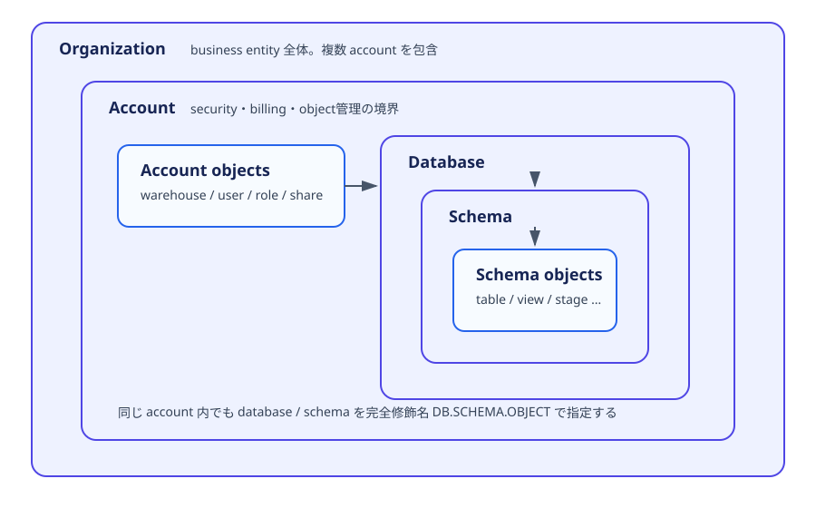

# 1.3 オブジェクト階層と種類を区別する

> Status: complete
> Last verified: 2026-08-13

## この章で学ぶこと

この章を終えると、organizationからschema objectまでの包含関係、account objectとdatabase objectの違い、代表的なschema objectの用途を説明できます。また、session context、SQL variable、parameterとprecedenceを区別できます。

## 前提知識

- databaseがdata objectをまとめる論理containerであること
- [1.2](02-interfaces-and-tools.md)で扱ったsession context
- roleとprivilegeが操作可否を決めること

## この章の用語

| 用語 | 意味 |
|---|---|
| Organization | 企業など1つのbusiness entityが所有するaccount群の最上位object |
| Account | user、role、warehouse、databaseなどを管理する境界 |
| Database | schemaを含むcontainer |
| Schema | table、view、stageなどのschema objectを名前空間としてまとめるcontainer |
| Account object | database内ではなくaccount直下で管理されるobject |
| Schema object | database内のschemaに属するobject |
| fully qualified name | `DATABASE.SCHEMA.OBJECT`形式の完全修飾名 |
| session context | current role、warehouse、database、schemaなど現在のsession状態 |
| parameter | account、session、objectの動作を制御する設定 |
| SQL variable | session内で利用者が`SET`し、`$name`で参照する値 |

## 試験範囲との対応

| Topic | 本文 | 根拠 |
|---|---|---|
| Organization／Account object | [包含関係と管理境界](#organization-account-objects) | `docs-organizations`, `docs-access-control-objects` |
| Database object | [schema objectの用途](#database-objects) | `docs-databases`, 各機能の公式docs |
| Session／context variable、parameter hierarchy／precedence | [実行文脈と設定値](#session-context-variables) | `docs-parameters`, `docs-sql-variables`, `docs-context-functions` |

## containerを上から辿る



Object名を正しく解決するには、包含関係と権限関係を分けて考えます。`ORG → ACCOUNT → DATABASE → SCHEMA → OBJECT`は主に配置と名前空間の階層です。role hierarchyはprivilege継承の階層であり、同じ図には混ぜません。

<a id="organization-account-objects"></a>
## OrganizationとAccountの境界

Organizationはbusiness entityに属する複数accountを結び付けます。accountをregionやcloud platformをまたいで管理し、organization-levelのusage、billing、replication、sharingなどを横断的に扱う単位です。

Accountは通常のdatabase作業における管理境界です。user、role、warehouse、resource monitor、integration、databaseなどがaccount内に存在します。warehouseはdatabaseやschemaの中には入りません。databaseとは独立したaccount-level compute objectだからです。

代表的なaccount objectと役割を整理します。

| Object | 役割 | database／schemaに所属するか |
|---|---|---|
| warehouse | query・DML用compute | しない |
| user／role | identityとprivilege管理 | しない |
| resource monitor | credit利用の監視・制御 | しない |
| share | account間で共有対象を公開するcontainer | しない |
| database | schemaを含むdata object container | accountに所属 |

<a id="database-objects"></a>
## Database、Schema、Schema objectを用途で区別する

Databaseは1つ以上のschemaを含み、schemaは同名objectを区別する名前空間です。完全修飾名`CERT_DB.PUBLIC.ORDERS`なら、`CERT_DB`がdatabase、`PUBLIC`がschema、`ORDERS`がschema objectです。

Study Guideに列挙された代表objectは次のように分類できます。

| Object | 主な役割 |
|---|---|
| stage | load／unloadするfileの場所を表す。internalとexternalがある |
| table | rowとcolumnでdataを保持する |
| view | query definitionに名前を付け、参照時に結果を作る |
| UDF | expression内から呼ぶ利用者定義function |
| file format | CSV、JSON、Parquet等のfile解釈規則を再利用する |
| stored procedure | 複数stepやside effectを持つ処理を呼び出す |
| pipe | Snowpipeがfileを継続取り込みする定義 |
| sequence | 一意値生成に使う数列object |
| ML model | model versionとinference methodを管理するschema-level object |
| application | Native App packageからinstallされるapplication object。account-level |
| share | 共有するobjectとconsumerを結ぶaccount-level object |

リスト内にはschema object以外も含まれます。「Database object」という試験語を、すべてがschema直下という意味で読まないことが重要です。share、application、warehouseなどはdatabase／schemaの外側で管理されます。

### UDFとstored procedure

UDFはqueryの式として値またはtableを返す処理に向きます。stored procedureはDDL／DMLを含む複数stepをまとめ、`CALL`で実行する処理に向きます。単に言語がPythonかSQLかではなく、query式の一部か、手続き的operationかで選びます。

### stageとfile formatとpipe

stageはfileの場所、file formatはfileの読み方、pipeは新着fileをtableへ取り込むCOPY statementの定義です。3つはdata ingestionで組み合わされますが、同じobjectではありません。

<a id="session-context-variables"></a>
## Session context、SQL variable、parameterを区別する

session contextは「いま誰として、どのcomputeと名前空間で実行しているか」です。context functionで確認します。

```sql
SELECT CURRENT_USER(), CURRENT_ROLE(), CURRENT_WAREHOUSE(),
       CURRENT_DATABASE(), CURRENT_SCHEMA();
```

SQL variableは利用者がsession内に一時的な値を置く仕組みです。

```sql
SET target_table = 'ORDERS';
SELECT * FROM IDENTIFIER($target_table);
UNSET target_table;
```

literal値として使うときは`$name`、object identifierとして使うときは`IDENTIFIER($name)`で明示します。variableは他sessionから見えず、session終了時に破棄されます。

ParameterはSnowflakeの動作設定です。3種類を混同しません。

| 種類 | 設定level | 例となる考え方 |
|---|---|---|
| account parameter | accountのみ | account全体の機能動作 |
| session parameter | account → user → session | timezone、statement timeout等のsession既定とoverride |
| object parameter | account → object | warehouse、database、schema、table等に固有の動作 |

session parameterでは、より具体的なlevelが上位のdefaultをoverrideします。account設定がuserのdefaultになり、user設定が新規sessionのdefaultになり、`ALTER SESSION`がcurrent sessionで上書きします。SQL variableの値にこのprecedenceは適用されません。

## 公式ドキュメント読解課題

1. `docs-access-control-objects`のsecurable object図で、warehouseとtableの親containerの違いを確認してください。
2. `docs-parameters`でaccount、session、object parameterを各1つ探し、設定可能levelを説明してください。
3. `docs-sql-variables`でliteral参照とidentifier参照の構文差を確認してください。

## 20分ミニハンズオン: 名前解決とsession限定値

既存のdatabase／schemaに`USAGE`、使用warehouseに`USAGE`が必要です。新規objectを作らないため追加storageはなく、query実行中はwarehouse computeを消費します。

```sql
SELECT CURRENT_DATABASE(), CURRENT_SCHEMA();
SET object_name = 'INFORMATION_SCHEMA.TABLES';
SELECT COUNT(*) FROM IDENTIFIER($object_name);
SHOW VARIABLES;
SHOW PARAMETERS IN SESSION;
UNSET object_name;
```

`INFORMATION_SCHEMA.TABLES`がcurrent database内で解決されること、variableとparameterが別の一覧であることを確認します。cleanupは`UNSET`だけです。

## 試験で重要なポイント

- Organizationは複数account、accountはdatabaseとaccount object、databaseはschema、schemaはschema objectを含む。
- warehouse、user、role、shareはschema objectではない。
- stage＝file場所、file format＝解釈規則、pipe＝継続load定義である。
- context function、SQL variable、parameterは目的とlifecycleが異なる。
- session parameterはaccount、user、sessionの順で具体的な設定がoverrideする。

## 間違えやすいポイント

- objectの包含階層とroleのprivilege継承階層を混同しない。
- `DB.SCHEMA.OBJECT`にwarehouse名は含まれない。
- SQL variableをobject名に使うとき、単なる`$name`ではなく`IDENTIFIER()`が必要である。
- parameterのdefault継承と、sessionで一時的に保存するSQL variableを同一視しない。

## 確認問題

- [C1-1.3-Q01: account objectとschema object](../../exercises/chapter/c1-1.3-q01.md)
- [C1-1.3-Q02: ingestion objectの役割](../../exercises/chapter/c1-1.3-q02.md)
- [C1-1.3-Q03: parameter precedence](../../exercises/chapter/c1-1.3-q03.md)

続けて[Domain演習D1-Q06〜Q07](../../exercises/domain/README.md)と[模擬問題M1-Q06〜Q07](../../exercises/mock/README.md)へ進みます。

## 章のまとめ

Snowflakeの配置階層はOrganization、Account、Database、Schema、Schema objectの順です。ただしwarehouse、share、applicationなどはschema外のaccount objectです。実行時にはcurrent contextで名前とcomputeを解決し、parameterはlevel間のprecedenceで、SQL variableはsession限定の値として扱います。

## 次に学ぶこと

次は[1.4 Virtual Warehouse](04-virtual-warehouses.md)で、account-level compute objectのsize、type、cluster数を選びます。

## 根拠・関連する公式ドキュメント

- `docs-organizations` — [Organizations](https://docs.snowflake.com/en/user-guide/organizations)
- `docs-access-control-objects` — [Access control overview](https://docs.snowflake.com/en/user-guide/security-access-control-overview)
- `docs-databases` — [Databases, Tables & Views](https://docs.snowflake.com/en/user-guide/databases)
- `docs-parameters` — [Parameters](https://docs.snowflake.com/en/sql-reference/parameters)
- `docs-sql-variables` — [SQL variables](https://docs.snowflake.com/en/sql-reference/session-variables)
- `docs-context-functions` — [Context functions](https://docs.snowflake.com/en/sql-reference/functions-context)
