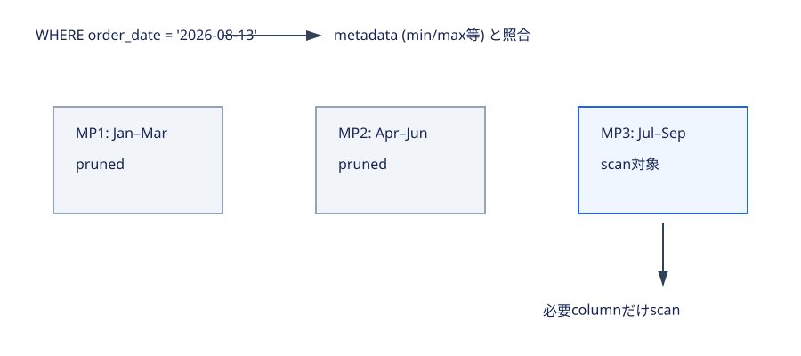

# 1.5 ストレージ概念を説明する

> Status: complete
> Last verified: 2026-08-13

## この章で学ぶこと

Micro-partitionとpruning、natural／explicit clustering、6つのtable type、standard／materialized／secure viewを、保存場所・更新方式・復旧性・securityから選べるようになります。

## 前提知識

- [1.1](01-architecture.md)のDatabase Storageとcolumnar storage
- predicate、column、metadataの基本
- Time Travelは過去dataを利用者が参照・復元する期間、Fail-safeはSnowflakeによる災害復旧期間であること

## この章の用語

| 用語 | 意味 |
|---|---|
| micro-partition | Snowflake tableを自動分割するimmutableなcolumnar storage単位 |
| pruning | metadataから不要partition／columnをscan対象外にすること |
| clustering | 特定columnの近い値が同じ／近いmicro-partitionに集まる度合い |
| clustering key | clustering維持の軸として明示するcolumn／expression |
| materialize | query結果をstorageへ保持すること |
| target lag | dynamic tableがbase dataに対して目標とする鮮度 |

## 試験範囲との対応

| Topic | 本文 | 根拠 |
|---|---|---|
| Micro-partition | [metadataとpruning](#micro-partitions) | `docs-micro-partitions` |
| Data clustering | [natural／explicit clustering](#data-clustering) | `docs-clustering-keys` |
| Table type | [保存・lifecycle・refreshで選ぶ](#table-types) | table type別公式docs |
| View type | [計算・保存・privacyで選ぶ](#view-types) | `docs-views`, `docs-secure-views` |

<a id="micro-partitions"></a>
## Micro-partition metadataがscanを減らす



Snowflake tableへdataをloadすると、Snowflakeが自動でmicro-partitionへ分割し、columnar形式で保存します。利用者がpartitionを事前定義する必要はありません。各micro-partitionにはcolumnごとの値範囲、distinct value数などのmetadataが記録されます。

Query optimizerはpredicateとmetadataを比較し、条件に一致し得ないmicro-partitionをpruneします。残ったpartitionでも不要columnをscanしません。Pruningはrowを読んでから捨てる処理ではなく、metadataでstorage scan自体を避ける仕組みです。

<a id="data-clustering"></a>
## Data clusteringは値範囲の重なりを減らす

Load順序がfilter軸と近ければnatural clusteringが形成されます。DMLが続くと同じ値範囲を持つmicro-partitionが重なり、pruning効率が落ちる場合があります。

Clustering keyはlarge tableで頻繁にselective filterやjoinへ使うcolumn／expressionを明示し、Automatic Clusteringで配置を維持します。すべてのtableに設定しません。reclustering computeとTime Travel storageが増えるため、query benefitがmaintenance costを上回る場合に使います。Clustering depthが小さいほど指定軸で重なりが少ない状態です。

<a id="table-types"></a>
## Table typeを保存場所・lifecycle・refreshで選ぶ

| Type | Dataの場所／更新 | 選定理由 |
|---|---|---|
| permanent | Snowflake storage、明示dropまで存続 | 本番data。Time Travel後に7日Fail-safe |
| temporary | Snowflake storage、作成session終了でpurge | session限定中間data。Fail-safeなし |
| transient | Snowflake storage、dropまで存続 | 再生成可能な長期中間data。Fail-safeなし |
| Apache Iceberg | Iceberg format。catalogとexternal／Snowflake-managed storage構成 | open table format、他engine interoperability |
| external | external stage上fileをtableのようにread-only query | loadせず外部fileを参照 |
| dynamic | SELECT結果をmaterializeしtarget lagに従い自動refresh | declarative data pipeline |

TemporaryとtransientはどちらもFail-safeがありません。違いはsession終了後のpersistenceです。Permanentを選ぶ理由は単に長寿命だからではなく、復旧保護を必要とするdataだからです。

Iceberg tableとexternal tableはいずれも外部storageに関係しますが、Icebergはopen table formatのmetadata／snapshot／transaction semanticsを持ちます。External tableはstage fileへのread-only schema-on-read interfaceです。

Dynamic tableはbase queryの結果を保持して更新します。通常tableへ自動loadする仕組みではなく、desired resultとtarget lagを宣言し、Snowflakeがdependencyとrefreshを管理します。

<a id="view-types"></a>
## View typeを計算・保存・privacyで選ぶ

| View | 結果保存 | 主目的／trade-off |
|---|---|---|
| standard | しない | query definition再利用。参照時に計算 |
| materialized | する | repeated expensive queryのscan削減。storageとmaintenance cost、定義制限あり |
| secure | standard／materializedの属性 | definitionとunderlying dataのprivacyを優先。optimization制約による性能影響あり |

Secureは「結果を保存するview type」と対立する軸ではありません。Non-materialized viewもmaterialized viewもsecureにできます。

## 公式ドキュメント読解課題

1. `docs-micro-partitions`でmetadata項目と2段階pruningを確認します。
2. `docs-temp-transient-tables`で3 typeのTime Travel／Fail-safeを表から比較します。
3. `docs-views`でmaterialized viewのcostと制限を確認します。

## 20分ミニハンズオン: metadataでpruningを観測する

Table作成権限とwarehouseが必要です。少量dataのみで、専用名を使いcleanupします。

```sql
CREATE TEMP TABLE cert_d1_15_t AS SELECT seq4() id, DATEADD(day, seq4(), '2026-01-01') d FROM TABLE(GENERATOR(ROWCOUNT=>10000));
SELECT COUNT(*) FROM cert_d1_15_t WHERE d BETWEEN '2026-02-01' AND '2026-02-07';
```

Query ProfileのPartitions scanned／totalを確認します。Temporary tableなのでsession終了でpurgeされますが、同session内では`DROP TABLE cert_d1_15_t`でcleanupします。

## 試験で重要なポイント

- micro-partitionは自動作成され、metadataがpruningを可能にする。
- clustering keyはlargeでselective queryが多いtableにcostを評価して使う。
- temporaryはsession限定、transientは明示dropまで、両方Fail-safeなし。
- external tableはread-only、dynamic tableはquery結果の自動refresh。
- secureとmaterializedは排他的分類ではない。

## 間違えやすいポイント

- warehouse sizeを上げても不十分なpruning自体は直らない。
- cluster keyをprimary keyやmicro-partition手動指定と混同しない。
- Icebergとexternal tableを「外部file」という一点で同一視しない。
- materialized viewを常に高速・低costと断定しない。

## 確認問題

- [C1-1.5-Q01](../../exercises/chapter/c1-1.5-q01.md) pruning
- [C1-1.5-Q02](../../exercises/chapter/c1-1.5-q02.md) clustering
- [C1-1.5-Q03](../../exercises/chapter/c1-1.5-q03.md) table type
- [C1-1.5-Q04](../../exercises/chapter/c1-1.5-q04.md) view type

[Domain D1-Q10〜Q11](../../exercises/domain/README.md)、[模擬M1-Q10〜Q11](../../exercises/mock/README.md)へ進みます。

## 章のまとめ

Snowflakeはmicro-partition metadataでpruningし、必要な場合だけclustering keyで値配置を維持します。Tableはpersistence、storage形式、更新方式から、viewは結果保存とprivacyから選びます。

## 次に学ぶこと

[1.6 AI/MLとapplication開発](06-ai-ml-app-development.md)でdataに近い開発機能を比較します。

## 根拠・関連する公式ドキュメント

- `docs-micro-partitions` — https://docs.snowflake.com/en/user-guide/tables-clustering-micropartitions
- `docs-clustering-keys` — https://docs.snowflake.com/en/user-guide/tables-clustering-keys
- `docs-temp-transient-tables` — https://docs.snowflake.com/en/user-guide/tables-temp-transient
- `docs-iceberg-tables` — https://docs.snowflake.com/en/user-guide/tables-iceberg
- `docs-external-tables` — https://docs.snowflake.com/en/user-guide/tables-external-intro
- `docs-dynamic-tables` — https://docs.snowflake.com/en/user-guide/dynamic-tables/overview
- `docs-views` — https://docs.snowflake.com/en/user-guide/views-introduction
- `docs-secure-views` — https://docs.snowflake.com/en/user-guide/views-secure
